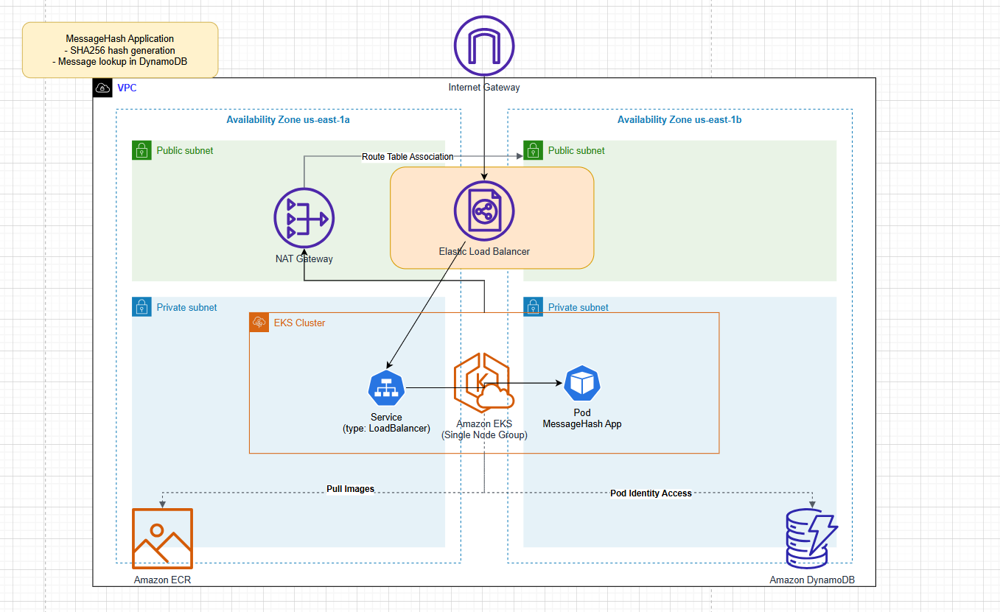

### Prerequisites

- Terraform >= 1.10
- AWS CLI
- Docker
- kubectl
- Helm

# Rigetti Exercise Workshop
`App Url`: http://k8s-webhashs-messageh-8d90208876-1d99252a8d05dae5.elb.us-east-1.amazonaws.com/

This repository contains Terraform configurations and supporting files for deploying an AWS infrastructure with EKS, DynamoDB, and a Python web application (Flask). The project is structured to facilitate the deployment of a message hash service.

Since this is Dev and to keep things simple:  
    - Terraform is deployed locally from my personal workstation.  
    - Monitoring, Security Groups/NACLs are not setup and route table configurations are minimal.  
    - There's only one NAT Gateway and a single node group set up in the EKS cluster.

## Architecture Diagram

If you're unable to view this image below, I've attached the diagram in file **`diagrams/AWS_Rigetti.drawio`**, which can be opened using [diagrams.net](https://app.diagrams.net/).

### Key Directories and Files

- **config/**: Contains configuration files such as `vars.yaml` for setting up the entire environment.
- **docker_build/**: Contains the Docker-related files including `Dockerfile`, `app.py`, and `requirements.txt` to build the image for the app.
- **modules/**: Contains Terraform modules for different components like `app`, `ecr`, `eks`, and `network`.
- **app.tf**: Main Terraform configuration file for the application module.
- **backend.tf**: Configuration for Terraform backend.
- **ecr.tf**: Configuration for AWS ECR.
- **eks.tf**: Configuration for AWS EKS.
- **network.tf**: Configuration for the network module.
- **provider.tf**: Provider configurations for AWS and Helm.
- **versions.tf**: Specifies the required Terraform and provider versions.

